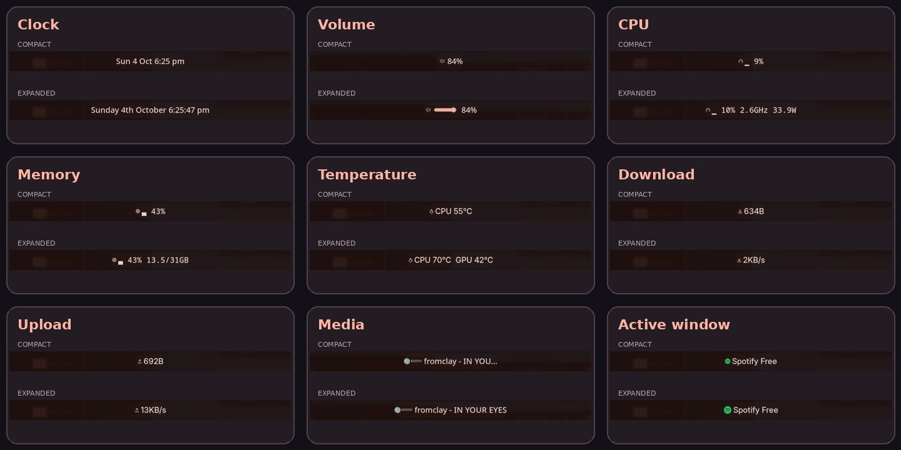

# Hover Widgets

One Noctalia plugin containing nine compact bar widgets. Each widget can be added independently and has its own settings; hover animations reveal extra details without permanently taking up bar space.

## Plugin

| Field | Value |
| --- | --- |
| ID | `pulser/hover-widgets` |
| Entries | Bar widgets: `clock`, `volume`, `cpu`, `ram`, `temp`, `net-down`, `net-up`, `media`, `active-window` |

## Requirements

Noctalia 5.2.0 or later (plugin API 32), on Linux. Commands declared by this bundle: `noctalia`, `wpctl`, `playerctl`, `sh`, and `wlrctl`. The clock and basic system monitors don't invoke the specialised commands; volume uses `wpctl`, media uses `playerctl` and `sh`, and active-window uses `wlrctl`. Because dependencies are declared at plugin scope, missing tools can be reported even if you only use another widget.

Artwork uses native ui.image corner rounding; ImageMagick is no longer needed. Volume and progress graphics are drawn directly. Optional `nvidia-smi` provides NVIDIA temperature. `wlrctl` requires wlr-foreign-toplevel-management-v1 support from the compositor. CPU temperature currently targets Intel coretemp; power needs readable Intel RAPL. See Notes for other hardware limits.

## Usage

Enable **Hover Widgets** in Settings → Plugins once. Add any of its entries independently in Settings → Bar; adding the bundle does not add all nine automatically. Each widget instance has its own settings.

| Entry | Display name | Widget type |
| --- | --- | --- |
| `clock` | Hover Clock | `pulser/hover-widgets:clock` |
| `volume` | Hover Volume | `pulser/hover-widgets:volume` |
| `cpu` | Hover CPU Monitor | `pulser/hover-widgets:cpu` |
| `ram` | Hover Memory Monitor | `pulser/hover-widgets:ram` |
| `temp` | Hover Temperature Monitor | `pulser/hover-widgets:temp` |
| `net-down` | Hover Download Monitor | `pulser/hover-widgets:net-down` |
| `net-up` | Hover Upload Monitor | `pulser/hover-widgets:net-up` |
| `media` | Mini Media | `pulser/hover-widgets:media` |
| `active-window` | Hover Active Window | `pulser/hover-widgets:active-window` |

### Hover Clock (`clock`)

Hover to reveal the full weekday, ordinal date, month and seconds. Uses local time and a 12-hour clock. The ordinal suffix is English; weekday and month names follow the locale.

### Hover Volume (`volume`)

Hover expands the original rounded track and circular knob. Click the speaker to mute/unmute; click the track to set volume. Percentage/padding and right-click open the anchored Audio panel. Speaker click can select Audio instead. Rapid writes are serialized and coalesced; stale reads cannot overwrite a newer request. Width and thickness are independent. Handle colour is separate from the track, defaulting to the native Settings slider colour. Turn Show handle off for a plain rounded bar.

Enable dragging to drag the same classic track; it folds after leaving or releasing, with a short grace period to move from the speaker to the drag target. Its width remains stable throughout an active drag. Volume changes continuously during dragging. This is optional and off by default.

### Hover CPU Monitor (`cpu`)

Shows CPU and optional GPU usage together. GPU usage comes from Noctalia system monitoring; a dash means unavailable or still loading. Hover to reveal CPU frequency and package power when available. Left-click opens the System Control Center.

### Hover Memory Monitor (`ram`)

Hover to reveal used/total memory and the percentage. Left-click opens the System Control Center.

### Hover Temperature Monitor (`temp`)

Hover to reveal enabled supplementary sensors. Left-click opens the System Control Center.

### Hover Download Monitor (`net-down`)

Shows receive throughput. Hover expands the reading. Set Hide completely to false to retain a hover target while idle. Left-click opens the System Control Center.

### Hover Upload Monitor (`net-up`)

Shows transmit throughput. Hover expands the reading. Set Hide completely to false to retain a hover target while idle. Left-click opens the System Control Center.

### Mini Media (`media`)

Click the rounded classic progress pill to seek. Width and thickness are independent of cover size; the point style can be Rounded or Flat. Choose Classic with dragging to keep the same pill and drag its playhead: the fill previews your target and seeks on release, using expanded width. Interactive uses the native slider appearance. Seeking requires player support.

Optional playback controls can appear always or only on hover. Hover highlights follow the theme. Classic progress uses a selectable theme colour. Background progress grows between compact and expanded widths and keeps its title on one line. Clicking the title/progress area seeks; artwork and playback controls retain their actions.

Cover/title clicks toggle playback; right-click opens Media; scrolling skips tracks. Hover expands the title. Hidden when no player is available.

### Hover Active Window (`active-window`)

Hover to expand the title and icon; long titles scroll. Hidden when no window is focused. Requires a compositor exposing wlr-foreign-toplevel-management-v1.

## Settings

Settings below belong to the named widget entry, not to the whole bundle. The clock has no plugin-specific settings.

### Hover Volume (`volume`)

| Setting | Type | Default | Description |
| --- | --- | --- | --- |
| `icon_click` | `select` | `mute` | Click the speaker to toggle mute, or open Audio. Click the expanded track to set volume. Percentage/padding and right-click open Audio. |
| `show_percent` | `bool` | `true` | Show volume percentage or muted. Click this label to open Audio. |
| `scroll_step` | `int` | `5` | How much one scroll notch changes the volume. |
| `invert_scroll` | `bool` | `false` | By default scroll up raises the volume. Turn this on if it feels backwards. |
| `drag_enabled` | `bool` | `false` | Drag the classic volume track. It folds when idle and stays open during an active drag. |
| `slider_width` | `int` | `90` | Expanded track width in pixels, independent of thickness and speaker size. |
| `slider_thickness` | `int` | `12` | Track thickness, independent of its width. The circular knob is 1.5 times this size. |
| `bar_color` | `select` | `primary` | Theme colour role used for the classic filled track and circular knob. |
| `point_style` | `select` | `rounded` | Rounded or flat moving progress edge. Flat also uses a slim rectangular volume handle. |
| `show_knob` | `bool` | `true` | Show the circle or flat handle at the current volume. Turn off for a plain bar. |
| `knob_color` | `select` | `on_primary` | Independent knob colour. On-primary matches the knob used by native Settings sliders. |

### Hover CPU Monitor (`cpu`)

| Setting | Type | Default | Description |
| --- | --- | --- | --- |
| `show_gpu` | `bool` | `true` | Show GPU utilisation beside CPU usage using Noctalia system monitoring. A dash means the sensor is unavailable or still loading. |
| `gauge` | `bool` | `true` | Compact display: gauge bar (on) or plain percentage (off) |

### Hover Memory Monitor (`ram`)

| Setting | Type | Default | Description |
| --- | --- | --- | --- |
| `gauge` | `bool` | `true` | Compact display: gauge bar (on) or plain percentage (off) |
| `amount_first` | `bool` | `false` | On: shows used GB by default, revealing the percentage and total on hover. Off: shows the percentage by default, revealing used/total GB on hover. |

### Hover Temperature Monitor (`temp`)

| Setting | Type | Default | Description |
| --- | --- | --- | --- |
| `show_gpu` | `bool` | `true` | Show GPU temp on hover |
| `show_nvme` | `bool` | `false` | Show hottest NVMe temp on hover |
| `show_ram` | `bool` | `false` | Show RAM (DIMM) temp on hover |
| `show_hottest_core` | `bool` | `false` | Show hottest CPU core on hover |

### Hover Download Monitor (`net-down`)

| Setting | Type | Default | Description |
| --- | --- | --- | --- |
| `threshold_kbps` | `int` | `1024` | Hide entirely below this; hovering always shows it. 1024 = 1 MB/s |
| `compact_units` | `bool` | `true` | 34K/1.2M instead of 34KB/s/1.2MB/s while not hovering |
| `hide_completely` | `bool` | `true` | On: vanishes below the idle threshold. Off: icon stays, only the number hides |

### Hover Upload Monitor (`net-up`)

| Setting | Type | Default | Description |
| --- | --- | --- | --- |
| `threshold_kbps` | `int` | `1024` | Hide entirely below this; hovering always shows it. 1024 = 1 MB/s |
| `compact_units` | `bool` | `true` | 34K/1.2M instead of 34KB/s/1.2MB/s while not hovering |
| `hide_completely` | `bool` | `true` | On: vanishes below the idle threshold. Off: icon stays, only the number hides |

### Mini Media (`media`)

| Setting | Type | Default | Description |
| --- | --- | --- | --- |
| `show_cover_art` | `bool` | `true` | Replace the play/pause icon with the track's (rounded) cover art when available. |
| `corner_rounding` | `int` | `100` | 0 = square corners, 100 = fully circular. |
| `cover_size` | `int` | `20` | Size of the cover art icon in place of the play/pause glyph. |
| `show_controls` | `bool` | `false` | Show previous, play/pause and next buttons. |
| `controls_on_hover` | `bool` | `false` | When Playback controls is enabled, animate those buttons in and out on hover. |
| `scroll_action` | `select` | `tracks` | Skip tracks or seek through the current song with the mouse wheel. |
| `scroll_seek_step` | `int` | `5` | Seconds per wheel step. Scroll up goes forward; down goes back. |
| `show_progress_bar` | `bool` | `true` | Show a playback-position bar next to the icon. It's a rendered image (not text), so it never affects the widget's Font setting -- when cover art is on, the bar sits beside the art; when off, it replaces the play/pause glyph. |
| `point_style` | `select` | `rounded` | Rounded or flat moving progress edge. Applies to classic and background progress; the native slider keeps its own style. |
| `progress_layout` | `select` | `inline` | Inline seekable bar or progress behind the media content. Click the background title/progress area to seek; artwork and buttons retain playback actions. |
| `audio_spectrum` | `bool` | `false` | Optional live audio visualiser, using the shell’s shared spectrum. |
| `audio_spectrum_bands` | `int` | `16` | Frequency bands, 8–128. |
| `visualiser_mode` | `select` | `overlay` | Background masking: overlay, played_only, inverted, progress. |
| `visualiser_color` | `color` | `secondary` | Theme/custom visualiser colour. |
| `visualiser_opacity` | `int` | `35` | Visualiser opacity, 0–100%. |
| `visualiser_height` | `int` | `12` | Maximum bar height, 4–24px. |
| `visualiser_width` | `int` | `48` | Inline visualiser width, 24–160px; background mode uses the full media width. |
| `background_progress_color` | `color` | `primary` | Native theme/custom colour picker for background progress. |
| `progress_darkening` | `int` | `0` | Darken the played fill itself, 0–80%, for background and classic progress. |
| `background_darkening` | `int` | `0` | Darkening of the unplayed background, 0–60%. Progress stays at full colour. |
| `background_width` | `int` | `260` | Compact background pill width, in pixels; it grows to Expanded background width on hover. |
| `background_expand_width` | `int` | `420` | Background pill width on hover, in pixels. Never smaller than Background width. |
| `background_height` | `int` | `22` | Thickness of the background progress pill, in pixels. |
| `background_seek_strip` | `bool` | `true` | Right-click playback controls to seek at their horizontal position on background progress. Left-click operates playback; right-click elsewhere opens Media controls. |
| `progress_style` | `select` | `classic` | Classic supports clicks. Classic with dragging keeps the same pill, uses expanded width, previews while dragging and seeks on release. Interactive uses the native slider appearance. |
| `progress_width` | `int` | `35` | Width of the seek slider in this state. Expanded width is at least the compact width. Set both equal for a fixed length. |
| `progress_expand_width` | `int` | `35` | Width of the seek slider in this state. Expanded width is at least the compact width. Set both equal for a fixed length. |
| `progress_thickness` | `int` | `8` | Progress bar thickness, independent of cover size and width. Rounded ends stay circular. |
| `bar_color` | `select` | `on_surface` | Theme colour for the classic media track and progress fill. |
| `compact_width` | `int` | `20` | Text width when not hovering. The text only actually shrinks to this if it's longer -- a short title just stays put. |
| `expand_width` | `int` | `40` | Text width while hovering. If the title is still longer than this, it scrolls as a marquee instead of growing further. |

### Hover Active Window (`active-window`)

| Setting | Type | Default | Description |
| --- | --- | --- | --- |
| `compact_width` | `int` | `20` | Text width when not hovering. The title only actually shrinks to this if it's longer -- a short title just stays put. Measured in characters. |
| `expand_width` | `int` | `40` | Text width while hovering. If the title is still longer than this, it scrolls as a marquee instead of growing further. Measured in characters. |
| `icon_size` | `int` | `20` | Per-app icon size when compact (not hovering). Only affects the real app icon -- the generic fallback glyph (shown when no icon can be resolved) is a fixed size, since the plugin API doesn't expose glyph sizing. Measured in pixels. |
| `icon_size_hover` | `int` | `28` | Per-app icon size while hovering; animates between this and the compact size along with the text width. Measured in pixels. |

## Notes

All entries are independent Luau runtimes. Media and volume caches are separated into `cache/media-mini` and `cache/volume-hover` beneath this plugin's persistent data directory, with a user-cache fallback. Helper scripts ship with the plugin. No remote code is downloaded or executed.

### Hover Clock

Reads the clock through Noctalia. No network calls or filesystem writes. No subprocesses.

### Hover Volume

Runs wpctl to query and adjust the default PipeWire sink, and noctalia for panel and mute actions. Volume shapes use native rendering. No network access. The packaged Noctalia Tabler font is used when found; otherwise a native glyph is shown.

### Hover CPU Monitor

Reads /proc/stat, CPU0 cpufreq, and Intel RAPL energy counters in /sys. No filesystem writes or network access. Launches noctalia only on click. Power requires readable Intel RAPL counters; it is omitted on unsupported hardware. Frequency is CPU0, not an all-core average.

### Hover Memory Monitor

Reads /proc/meminfo and calculates used memory from MemTotal minus MemAvailable. Values labeled GB are binary GiB. No network or filesystem writes. Launches noctalia only on click.

### Hover Temperature Monitor

Reads Linux hwmon names, labels and temperatures under /sys/class/hwmon. Supports Intel coretemp CPU sensors, NVMe composite sensors and spd5118 DIMMs. Optional nvidia-smi queries NVIDIA GPU temperature on hover. Unsupported or inaccessible readings are omitted; missing CPU temperature displays --°C. No network or filesystem writes. Launches noctalia on click.

### Hover Download Monitor

Reads interface counters from /proc/net/dev. No network requests or filesystem writes. Aggregates non-loopback interfaces; bridge, VPN and physical interfaces can double-count the same traffic. Threshold is KiB/s; KB/s and MB/s labels represent binary units. Launches noctalia only on click.

### Hover Upload Monitor

Reads interface counters from /proc/net/dev. No network requests or filesystem writes. Aggregates non-loopback interfaces; bridge, VPN and physical interfaces can double-count the same traffic. Threshold is KiB/s; KB/s and MB/s labels represent binary units. Launches noctalia only on click.

### Mini Media

Runs the shipped pick-player.sh through sh; it uses playerctl to prefer a Playing MPRIS player. Playback controls target the same selected player that supplies the displayed metadata. Artwork corners and progress images use native rendering. Remote HTTP(S) artwork is downloaded using Noctalia; missing YouTube artwork may request i.ytimg.com thumbnails. Requests disclose your IP and the requested artwork/video id to that host. Local file:// artwork is read directly. Cache images are written only under the plugin data directory. No remote code is executed.

### Hover Active Window

Runs wlrctl to read the focused app id and window title. App icons resolve through Noctalia’s native desktop-entry/icon-theme resolver. No network calls, filesystem writes or external image-processing helper. Window titles can contain private information; consider this before sharing screenshots.

## Migration from separate plugins

The previous entries used different plugin IDs. Replace each old bar widget with the corresponding `pulser/hover-widgets:<entry>` listed above. Reapply your preferred settings to the new instance. After replacement, disable the separate plugin. No automatic migration or removal is performed.

## License

MIT.

## Native panel actions

Clock left-click opens the Control Center Calendar page, matching the native clock. Volume opens Audio, system monitors open System, and media right-click opens Media. These are native widget actions, so panel placement follows Noctalia’s positioning settings and retains the originating widget anchor. Per-instance action settings can override these defaults.

## Version 1.1.0

Original visual styles remain the defaults. Volume has separate speaker, track and label click targets. Media adds configurable compact/expanded progress widths and an opt-in Interactive seek-slider style. Seeking commits on release and targets the displayed player; pending seeks are discarded when its track changes.

## Version 1.2.0

Classic progress bars now accept position clicks without changing their artwork. Volume clicks map onto the original knob travel; media clicks seek the displayed player to the corresponding point in the track. Media refreshes visibility as soon as a metadata query completes.

Version 1.2.1 gives volume immediate click feedback and refreshes the classic knob as soon as its raster frame completes.

## Version 1.3.0

Volume uses a serialized latest-request queue and discards stale polling results. Rounded bars and knobs are drawn at their actual dimensions, with independent width/thickness. Optional dragging keeps classic shapes, using Noctalia pointer capture; volume updates continuously and media seeks on release.

## Version 1.4.0

Adds a separate Circle colour selector (default: on-primary, matching native Settings sliders) and Show circle knob toggle. Drawing and pointer layers share a fixed centre line, so changing thickness keeps the bars vertically aligned in click and drag modes. Track and moving fill ends use rounded shapes.

## Version 1.5.0

Adds Rounded/Flat point styles to volume and media. Flat gives the volume handle a slim rectangular shape; Show handle and Handle colour apply to both shapes. Fixes drag input width and maps pointer positions to the visible handle/playhead. Optional playback controls add previous, play/pause and next. Progress placement can put a tinted progress pill behind media content, with independent background width and thickness. Background progress is seekable by clicking the title/progress area; artwork and buttons retain playback actions. Vertical bars use the inline layout.

## Version 1.6.0

Restores folding in volume drag mode and keeps input width fixed during an active drag. Correctly preserves explicit false settings, fixing Show handle and Show percentage. Handles have a contrasting theme outline. Adds media Controls only on hover, themed hover highlights, classic Progress colour, and Expanded background width. Media labels are limited to one line.

## Version 1.7.0

Hover-only controls fade and expand into place. A 120ms leave grace period prevents child-to-child hover transitions collapsing the widget or restarting the marquee. Background progress is seekable from the title area and unoccupied background; artwork and buttons keep playback actions. Related settings use Noctalia conditional visibility for controls, cover art, handle colour and progress placement.

## Version 1.8.0

Serializes metadata polling and preserves the last valid media through five transient failures; six consecutive misses hide the widget until a valid read returns. Metadata checks run every 500ms while idle. Artwork uses persistent URL-keyed downloads, renders immediately on completion, and uses native ui.image rounding instead of ImageMagick. Background titles use their remaining pixel width rather than inline character limits; inline text-width settings hide in background mode. Play/pause glyphs are larger while retaining the same button targets.

## Version 1.9.0

Reduces play/pause glyphs slightly (18px in the 20px controls). Adds a full-width 4px click target at the lower edge of background progress without an extra visible line, so seeking remains possible underneath artwork and playback controls. Its Seek beneath controls setting defaults on. Button centres retain playback actions. Scroll action optionally seeks playback by a configurable number of seconds (up forward/down back); track skipping remains the default. Seek writes are serialized/coalesced, and stale metadata cannot undo a new target. Unplayed volume/media tracks use a subtle dark translucent background. Settings place controllers before their conditional dependants. The CPU widget now shows GPU usage alongside CPU, with a Show GPU usage toggle.

## Version 1.9.1

Fixes playback buttons being covered by transparent seek-layout nodes. The foreground remains on its original vertical centre and above the seek anchor in hit-test order. The lower-edge seek footer is outside button targets. Background media leaves the unplayed area transparent so the host capsule matches other widgets; progress uses the full theme primary colour.

## Version 1.9.2

Replaces the seek footer with right-click seeking over playback controls, usable in thin bars. The existing `background_seek_strip` key controls this option for compatibility. Hover icons keep their contrasting theme colour. The media right-click gesture binding must be `none` to let the plugin route right-clicks; the plugin opens Media controls outside the playback buttons.

## Version 1.9.3

Adds theme colour selection and adjustable darkening for background progress. Zero darkening retains the normal capsule background. Artwork now aligns to the left, and title/control seek coordinates follow the new position.

## Version 1.9.4

Adds native theme/custom progress colour pickers and a separate Progress darkening setting that shades only the played fill.

## Version 1.9.5

The upper/lower 2px of media control targets no longer highlight the playback button. Widget expansion and right-click seek tracking continue there.

## Version 1.9.6

Left-click the top/bottom 5px seek areas of playback controls to seek without a button highlight. Left-click their centres for playback; right-click anywhere over them to seek.

## Version 1.10.0

Adds optional audio bars using Noctalia’s shared PipeWire spectrum callback. Visualiser rendering stays below pointer/control layers. Paused/idle audio clears the spectrum and avoids repeated idle rendering; inline width remains stable. The feature defaults off, with conditional appearance settings.

## Version 1.11.0

Adds adjustable band count and four visualiser masks in background layout. Played-only hides bars over unplayed background. Inverted uses black bars over progress and Visualiser colour outside it. Progress replaces the solid fill with played audio bars, using Progress colour and darkening; a quiet/paused baseline retains position. Bands crossing the position boundary split precisely. Band widths and gaps scale to fit, including 128 bands in compact widgets.

## Version 1.11.1

Inline visualiser width is visible only for Inline progress placement.

## Version 1.12.0

Hover expansion fits the title up to the configured maximum. Capped titles continue cycling on hover. Background width estimates include artwork, revealed controls and proportional text advances; estimates are cached per title. Inline character limits also stop at the title length. Inverted progress-side visualiser bars use a softer translucent dark colour.

## Version 1.12.1

RAM uses the Lucide memory-stick icon, tinted to the active on_surface theme colour and cached per palette.

### RAM icon asset

`assets/memory.svg` is a clean vector RAM outline based on the user-provided reference, with three chip windows, side notches and six bold protruding contacts. It uses currentColor and is tinted to the active theme.

## Version 1.12.2

RAM uses the bolder Bootstrap memory icon with three large chip cut-outs, displayed 20px wide for better small-size legibility.

## Version 1.12.3

Uses a clean vector three-chip RAM outline based on the user reference, with a thicker 1.8-unit outline, six wider protruding contacts, a tightly fitted SVG viewport and theme tint.
